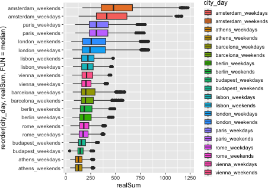
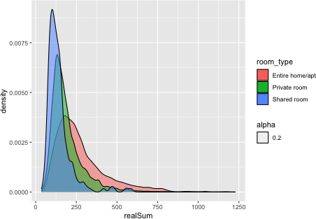
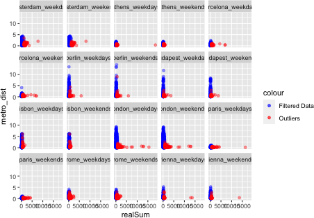
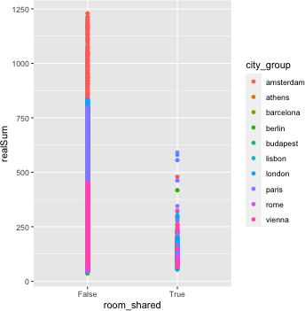
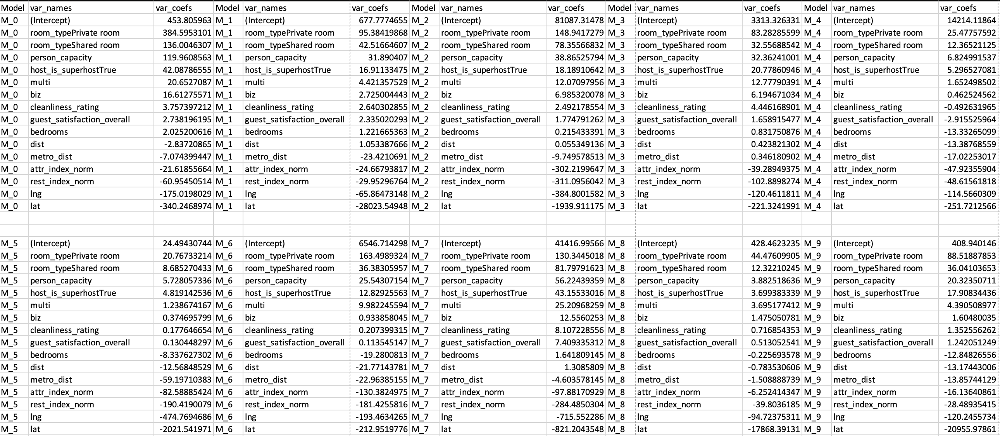
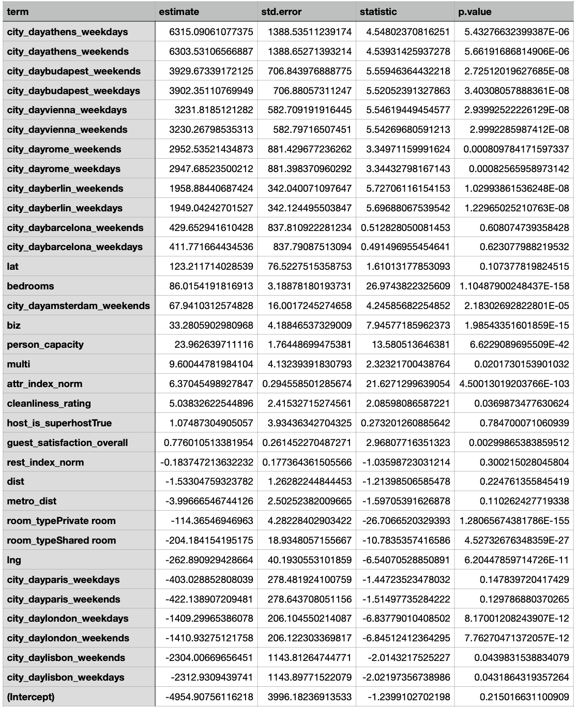
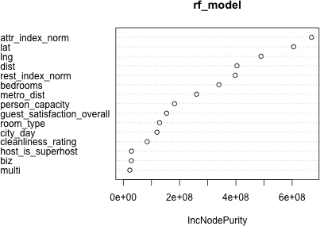

```{r setup, include=FALSE}
library(formatR)
library(tidyverse)
library(GGally)
library(ggfortify)
library(nycflights13)
library(modelr)
library(magick)
library(haven)
library(dplyr)
library(ISLR)
library(broom)
library(lubridate)
library(ggplot2)
library(nycflights13)
library(knitr)
library(caret)
library(car)
library(kableExtra)
library(glmnet)
library(corrplot)
library(xgboost)
library(randomForest)
library(Metrics)
library(broom)
knitr::opts_chunk$set(width = 60, warning = FALSE, message = FALSE, tidy.opts=list(width.cutoff=60),tidy=TRUE, echo = TRUE, dev = "png")
```

# Abstract

Airbnb has disrupted the hospitality industry by providing a platform for short-term rentals. Understanding the factors that determine Airbnb prices is essential for both hosts and guests. This report explores the determinants of Airbnb prices in Europe using data from the publicly available dataset 'Airbnb Price Determinants' from [Kaggle](https://www.kaggle.com/datasets/thedevastator/airbnb-price-determinants-in-europe). In this study, we have explored linear and polynomial regression and random forest models to determine the price of a room and found the main determinants based on the coefficient values.

# Introduction

Airbnb has grown rapidly in Europe, providing a popular alternative to traditional hotels and accommodations. The platform enables hosts to rent out their homes or rooms to guests, often at lower prices than hotels. Airbnb offers guests the opportunity to experience local neighborhoods and culture more authentically. For hosts, Airbnb provides a source of income and an opportunity to meet people worldwide. However, Airbnb prices can vary widely, and understanding the factors determining these prices is important for hosts and guests.

How can this information be used: Data can help travelers find accommodation that meets their needs without exceeding budget. Can help hosts set competitive pricing and optimize listings to get more bookings. Help investors evaluate the value of investing in real estate in different European cities based on pricing trends.

# Methods

To explore the determinants of Airbnb prices in Europe, we used data on Airbnb listings in ten major European cities (Amsterdam, Athens, Barcelona, Berlin, Budapest, Lisbon, London, Paris, Rome, Vienna). The data consists of various attributes about the hotel. We used regression analysis and random forest to determine the factors that are strongly associated with Airbnb prices in Europe.

## Exploratory Data Analysis

We did EDA for the following variables



$$Figure 1$$

The highest prices in Europe are found in Amsterdam.



$$Figure 2$$

The prices of entire home are high comparatively



$$Figure 3$$

In general the rooms that are closer to metro have comparatively higher prices. But, in Rome city the distance to metro is almost same for both categories of price.


$$Figure 4$$

The attractive index of cities is varying across different cities it is higher for some cities like Paris.



$$Figure 5$$

There are differences in room prices between both share and non-shared rooms.

## Pre Processing

The room_shared and room_private information is already embedded in room_type. The variables are multi-collinear, so we have removed room_shared and room_private.

## Multivariate linear regression

Multivariate linear regression is a statistical method that models the relationship between multiple input variables and a continuous output variable. A linear equation is fitted to the input variables, with coefficients representing each input variable's contribution to the output variable. The model assumes that the relationship between the input and output variables is linear and that errors are normally distributed and independent.

## Polynomial regression

In polynomial regression, the input variables are raised to various powers. The degree of the polynomial determines the complexity of the model and the number of input variables used in the model. Polynomial regression is useful when the relationship between the input variables and the output variable is not linear and can provide a better fit to the data than linear regression.

## Interaction Variables

Interaction variables, also known as interaction effects, refer to the impact that the combination of two or more input variables has on the output variable in a regression model. They capture the non-additive relationship between input variables and can help to explain better the relationship between the input variables and the output variable. The interaction variables are created by multiplying the values of two or more input variables and including them as additional terms in the model. The coefficient of an interaction variable represents the change in the response variable for a one-unit change in one input variable while holding the other input variables constant.

## Random forest regression

Random forest regression is a machine learning technique that combines the power of decision trees with the concept of ensemble learning.

Decision trees work by recursively partitioning the input data into subsets based on the values of the input features to minimize the variance of the target variable within each subgroup. The result is a tree-like structure representing a set of rules for predicting the target variable. Each internal node in the tree corresponds to a test on one of the input features, and each leaf node corresponds to a predicted target variable value. During the prediction phase, the input data is traversed down the tree according to the rules represented by the internal nodes until a leaf node is reached, which provides the predicted value for the target variable. Decision trees handle non-linear relationships between features and the target variable. However, it is prone to overfitting, especially when the tree is deep, and can be sensitive to small changes in the input data.

In Random Forest, multiple decision trees are trained on different subsets of the input data, and the results are combined to make predictions. Each tree in the forest is trained on a random subset of the available features, which helps to reduce overfitting and increase the model's generalization performance. During the prediction phase, the output of each tree is aggregated to produce a final prediction.

# Data

Each major city has its own dataset for weekend and weekdays Variables included in data set:

-   Host ID (Id)
-   Total price of listing (realSum)
-   Room type: private, shared, entire home, apt (room_type)
-   Whether or not room is shared (room_shared)
-   Max number of people allowed in property (person_capacity)
-   Whether or not host is superbost (host_is_superhost)
-   Whether or not it is multiple rooms (multi)
-   Whether for business or family use (biz)
-   Distance from city center (dist)
-   Distance from nearest metro (metro_dist)
-   Latitude and longitude (lat lng)
-   Guest satisfaction (guest_satisfaction_overall)
-   Cleanliness (cleanliness_rating)
-   Total quantity of bedrooms available among all properties for single host (bedrooms)
-   Index of Attractions near the hotel (attr_index)
-   Normalized Index of Attractions near the hotel (attr_index_norm)
-   Index Restaurants near the hotel (rest_index)
-   Normalized Index of Restaurants near the hotel (rest_index_norm)

The dataset consists of

-   Continuous variables : realSum, dist, metro_dist, lat, lng, attr_index, attr_index_norm, rest_index, rest_index_norm
-   Ordinal : person_capacity, guest_satisfaction_overall, cleanliness_rating, bedrooms
-   Nominal : room_type, room_shared, host_is_superhost, multi, biz

# Results

We have modeled multivariate regression for each city, and below are the coefficients of each model arranged in descending order. The coefficient with a larger value is the essential determinant of the hotel room price.

According to the table, all the models have the same descending order of coefficients. The order is as follows:

1 - room_type 2 - person_capacity 3 - host_is_superhost 4 - multi 5 - biz 6 - cleanliness_rating 7 - guest_satisfaction_overall 8 - bedrooms 9 - dist 10 - metro_dist 11 - attr_index_norm 12 - rest_index_norm, 13 - lng 14 - lat

## Modelling

### MVLR Seperated by City and Day



M_0 - Amsterdam, M_1 - Athens, M_2 - Barcelona, M_3 - Berlin, M_4 - Budapest, M_5 - Lisbon, M_6 - London, M_7 - Paris, M_8 - Rome, M_9 - Vienna

### MVLR Combined of all Cities



Apart from Cityday, below are the ranking of coefficients of the model

1.  Lat, 2. bedrooms, 3. biz, 4. person_capacity, 5. Multi, 6. Attr_index_norm, 7. Cleanliness_rating, 8. host_is_superhost, 9. guest_satisfaction_overall, 10. rest_index_norm 11. dist, 12. metro_dist, 13. room_type, 14. lng

The city day coefficients are almost ranked at the top.

### Other Models

| Model                        | Train $R^2$ | Train Adj $R^2$ | Train $RMSE$ | Test $R^2$ | Test Adj $R^2$ | Test $RMSE$ |
|-----------|-----------|-----------|-----------|-----------|-----------|-----------|
| MLR                          | 0.2150414   | 0.2146725       | 304.9175     | 0.33744    | 0.3371287      | 233.2618    |
| MLR with Step                | 0.2149964   | 0.2146275       | 304.9262     | 0.3373441  | 0.3370327      | 233.2787    |
| MLR with IVs                 | 0.2159815   | 0.215613        | 304.7348     | 0.3379444  | 0.3376333      | 233.173     |
| MLR with IVs, Step           | 0.2159435   | 0.215575        | 304.7422     | 0.3380392  | 0.3377281      | 233.1563    |
| Poly with Order 2            | 0.2154699   | 0.2151012       | 304.8342     | 0.3373538  | 0.3370424      | 233.277     |
| Poly with Order 2, Step      | 0.2154289   | 0.2150602       | 304.8422     | 0.3373204  | 0.337009       | 233.2829    |
| Poly with Order 2, IVs       | 0.22214     | 0.2217744       | 303.5356     | 0.334993   | 0.3346805      | 233.6922    |
| Poly with Order 2, IVs, Step | 0.2221344   | 0.2217689       | 303.5367     | 0.3350694  | 0.3347569      | 233.6788    |
| Poly with Order 3            | 0.2160624   | 0.215694        | 304.7191     | 0.3375855  | 0.3372742      | 233.2362    |
| Poly with Order 3, Step      | 0.2160337   | 0.2156653       | 304.7247     | 0.3376519  | 0.3373407      | 233.2245    |
| Poly with Order 3, IVs       | 0.2330663   | 0.2327059       | 301.3962     | 0.1901115  | 0.189731       | 257.8955    |
| Poly with Order 3, IVs, Step | 0.2285384   | 0.2281759       | 302.2846     | 0.3281442  | 0.3281442      | 234.8925    |
| Lasso With Order 1           | 0.215693    | 0.2147166       | 325.7776     | 0.3372306  | 0.3353023      | 233.2987    |
| Lasso With Order 2           | 0.2201963   | 0.217819        | 326.6683     | 0.1830879  | 0.1772535      | 259.0113    |
| Lasso With Order 3           | 0.2228371   | 0.2166688       | 326.2303     | 0.02854527 | 0.01036279     | 282.4505    |
| Random Forest                | 0.8747755   | 0.8724317       | 121.7878     | 0.7588743  | 0.7543612      | 140.719     |

\* IVs here is Interaction variables

### Random Forest

We have trained Random Forest on all cities' combined data, and below are the important variables.

|                            | IncNodePurity |
|----------------------------|---------------|
| room_type                  | 122087850     |
| host_is_superhost          | 26594131      |
| multi                      | 21575815      |
| biz                        | 24190212      |
| city_day                   | 114299029     |
| person_capacity            | 183757090     |
| cleanliness_rating         | 79985960      |
| guest_satisfaction_overall | 162106050     |
| bedrooms                   | 342017315     |
| dist                       | 423128244     |
| metro_dist                 | 248206656     |
| attr_index_norm            | 662153431     |
| rest_index_norm            | 435838043     |
| lng                        | 482308349     |
| lat                        | 588248566     |



The random forest model has chosen the attraction index as the most important variable, which makes more sense from a general point of view because the places with more attractions would attribute to pricing differences. The other variables ranking also seems consistent with common sense, such as latitude and longitude, which indicates location and distance from the city center, etc.

Overall the random forest has performed better than the other models with a Adjusted. $R^2$ value of 0.7543 and RMSE of 140.719 compared to the best regression model, which has Adjusted $R^2$ value of 0.3377 and RMSE of 233.1563 on the test set.

# Discussion

When we applied separate models for each city data, on linear regression, latitude was least ranked, but when we combined all the data latitude is on top rank next to city day, it indicates the information about location is being captured by the latitude when all data is combined, in separate models all the data about city represents it location so latitude is least ranked.

The attraction index is ranked higher in all cities combined model than separated models. (From $Figure$ $4$)

The host_is_super host is ranked high in individual models than combined model, but its significance value is very low.

Room Type is ranked at the top in separate models, but in the combined model is at quite a low rank. It is due to the information of Room Type capturing the information about the location; it can be inferred from the graph $Figure$ $5$

# Summary

This report investigates the factors that determine Airbnb room prices in Europe using data from the publicly available dataset 'Airbnb Price Determinants.' To identify the main determinants of Airbnb room prices in Europe, the report employed a regression analysis and random forest model. The dataset was collected from ten major European cities, including Amsterdam, Athens, Barcelona, Berlin, Budapest, Lisbon, London, Paris, Rome, and Vienna. Exploratory data analysis was conducted on various attributes of the data. The report discovered that Amsterdam has the highest Airbnb room prices in Europe. In general, entire homes have higher prices compared to shared rooms. The proximity of a room to a metro station was found to be correlated with higher prices. However, in Rome, the distance to the metro station has a negligible impact on room prices. The study also discovered that there are differences in room prices between shared and non-shared rooms. Furthermore, the study used multivariate linear regression, polynomial regression, interaction variables, and random forest regression to identify the factors that are strongly associated with Airbnb prices in Europe. The report demonstrates that the main determinants of Airbnb room prices in Europe include the number of people allowed in a room, the room type, and the host's superhost status. The report provides valuable insights for Airbnb guests, hosts, and investors in evaluating the value of investing in real estate in different European cities based on pricing trends.

# Appendix for Code and Detailed Analysis

# Pre Processing and Cleaning the Data

## Data loading

```{r}
# Set the relative directory path
my_dir <- "./archive"

# List all the files in the directory
files <- list.files(path = my_dir, full.names = TRUE)
```

### Combining the Data from all Files

```{r echo=T, results='hide'}
# Get a list of all the csv files in the directory
file_list <- list.files(path = my_dir, pattern = "*.csv", full.names = TRUE)

# Initialize an empty list to store the data frames
df_list <- list()

# Loop through each file and read it into a data frame
for (i in seq_along(file_list)) {
  df <- read.csv(file_list[i])
  
  # Add a new column with the city_day
  df$city_day <- basename(file_list[i])

  # Append the data frame to the list
  df_list[[i]] <- df
}

# Combine all the data frames into a single dataset
my_data <- bind_rows(df_list)

#Removing the .csv ext
my_data$city_day <- gsub("\\.csv", "", my_data$city_day)

# Print the first few rows of the data
head(my_data)
```

```{r}
print(unique(my_data[my_data$room_shared == my_data$room_private, ]$room_type)) # if the room is shared 
```

```{r}
print(unique(my_data[my_data$room_private=='False', ]$room_type))
```

```{r}
print(unique(my_data[my_data$room_shared=='True', ]$room_type))
```

```{r}
print(unique(my_data[my_data$room_shared=='False', ]$room_type))
```

The room_shared and room_private information is already embedded in room_type. The variables are multi-collinear, so we can remove room_shared and room_private.

### Dropping columns of room_shared and room_private

```{r}
my_data = select(my_data, -c(room_shared, room_private))
head(my_data)
```

```{r}
ggplot() +
  geom_point(data = my_data, aes(x = attr_index, y = attr_index_norm), alpha = 0.4) 

ggplot() +
  geom_point(data = my_data, aes(x = attr_index, y = attr_index_norm), alpha = 0.4) +
  facet_wrap(~city_day)
```

attr_index and attr_index_norm are same, attr_index_norm is just normalized attr_index

```{r}
ggplot() +
  geom_point(data = my_data, aes(x = rest_index, y = rest_index_norm), alpha = 0.4)

ggplot() +
  geom_point(data = my_data, aes(x = rest_index, y = rest_index_norm), alpha = 0.4) +
  facet_wrap(~city_day)
```

rest_index and rest_index_norm are same, rest_index_norm is just normalized rest_index.

removing attr_index and rest_index

```{r echo=T, results='hide'}
my_data = select(my_data, -c(attr_index, rest_index))
head(my_data)
```

## Outliers using IQR Range

### Filtering out the Outliers from Data Out of IQR Ranges

```{r}
# Initialize an empty list to store the outliers
outliers_list <- list()

# Initialize an empty list to store the filtered data frames
df_list_filtered <- list()

# Loop through each file and read it into a data frame after removing outliers
for (i in seq_along(file_list)) {
  df_filtered <- read.csv(file_list[i])
  
  # Add a new column with the city_day
  df_filtered$city_day <- gsub("\\.csv", "", basename(file_list[i]))
  
  iqr_var1 <- IQR(df_filtered$realSum)

  # Calculate the upper and lower bounds for each variable
  upper_var1 <- quantile(df_filtered$realSum, 0.75) + 1.5*iqr_var1
  lower_var1 <- quantile(df_filtered$realSum, 0.25) - 1.5*iqr_var1


  # Filter the data based on the upper and lower bounds for each variable
  filtered_data <- filter(df_filtered, realSum > lower_var1 & realSum < upper_var1)


  # Append the filtered data frame to the list
  df_list_filtered[[i]] <- filtered_data
  
  # Get the rows that were removed while filtering
  outliers <- anti_join(df_filtered, filtered_data)
  
  # Append the outliers to the list
  outliers_list[[i]] <- outliers
}


# Combine all the filtered data frames into a single dataset
my_data_filtered <- bind_rows(df_list_filtered)

#Removing the .csv ext
my_data_filtered$city_day <- gsub("\\.csv", "", my_data_filtered$city_day)

summary(my_data_filtered)

# Combine all the outliers into a single dataset
my_outliers <- bind_rows(outliers_list)

#Removing the .csv ext
my_outliers$city_day <- gsub("\\.csv", "", my_outliers$city_day)

summary(my_outliers)
```

### Percentage of Outliers outside of IQR range.

```{r}
# Create empty table
outliers_table <- data.frame(City_day = character(),
                             Data_Length = numeric(),
                             Percent_Outliers = numeric(),
                             stringsAsFactors = FALSE)

# Loop through city_data and fill in table
for (city_day in unique(my_data$city_day)){
  x = my_data[my_data$city_day == city_day, ]$realSum
  q1 <- quantile(x, 0.25)
  q3 <- quantile(x, 0.75)
  iqr <- IQR(x)
  upper_bound <- q3 + 1.5*iqr
  lower_bound <- q1 - 1.5*iqr
  x_no_outliers <- x[x >= lower_bound & x <= upper_bound]
  percent_outliers <- ((length(x) - length(x_no_outliers))/length(x))*100
  
  # Add row to table
  outliers_table <- rbind(outliers_table, 
                          data.frame(City_day = city_day, 
                                     Data_Length = length(x), 
                                     Percent_Outliers = percent_outliers))
}

# Format table using kable
kable(outliers_table, format = "markdown")
```

## Spilt Training and Testing Data

```{r}
set.seed(123456789)
my_data_train <- my_data[sample(nrow(my_data), 0.7*nrow(my_data)), ]
my_data_test <- my_data[setdiff(1:nrow(my_data), rownames(my_data_train)), ]
dim(my_data_train)
dim(my_data_test)
```

# Exploratory Data Analysis

## Outlier Analysis

### Metro Dist vs Real Sum

We have planned to analyse the filtered data along with outlier data. Here outlier data represents the hotel rooms with high prices.

```{r}
ggplot() +
  geom_point(data = my_data_filtered, aes(x = realSum, y = metro_dist, color = "Filtered Data"), alpha = 0.4) +
  geom_point(data = my_outliers, aes(x = realSum, y = metro_dist, color = "Outliers"), alpha = 0.4) +
  scale_color_manual(values = c("Filtered Data" = "blue", "Outliers" = "red"))

ggplot() +
  geom_point(data = my_data_filtered, aes(x = realSum, y = metro_dist, color = "Filtered Data"), alpha = 0.4) +
  geom_point(data = my_outliers, aes(x = realSum, y = metro_dist, color = "Outliers"), alpha = 0.4) +
  scale_color_manual(values = c("Filtered Data" = "blue", "Outliers" = "red")) +
  facet_wrap(~city_day)
```

In general the rooms that are closer to metro have comparatively higher prices. But, in Rome city the distance to metro is almost same for both categories of price.

### Real Sum vs Distance

```{r}
ggplot() +
  geom_point(data = my_data_filtered, aes(x = realSum, y = dist, color = "Filtered Data"), alpha = 0.4) +
  geom_point(data = my_outliers, aes(x = realSum, y = dist, color = "Outliers"), alpha = 0.4) +
  scale_color_manual(values = c("Filtered Data" = "blue", "Outliers" = "red"))

ggplot() +
  geom_point(data = my_data_filtered, aes(x = realSum, y = dist, color = "Filtered Data"), alpha = 0.4) +
  geom_point(data = my_outliers, aes(x = realSum, y = dist, color = "Outliers"), alpha = 0.4) +
  scale_color_manual(values = c("Filtered Data" = "blue", "Outliers" = "red")) +
  facet_wrap(~city_day)
```

In general the pricey rooms are near to the centre of the city.

### Real Sum vs Attraction Index Normal

```{r}
ggplot() +
  geom_point(data = my_data_filtered, aes(x = realSum, y = attr_index_norm, color = "Filtered Data"), alpha = 0.4) +
  geom_point(data = my_outliers, aes(x = realSum, y = attr_index_norm, color = "Outliers"), alpha = 0.4) +
  scale_color_manual(values = c("Filtered Data" = "blue", "Outliers" = "red"))

ggplot() +
  geom_point(data = my_data_filtered, aes(x = realSum, y = attr_index_norm, color = "Filtered Data"), alpha = 0.4) +
  geom_point(data = my_outliers, aes(x = realSum, y = attr_index_norm, color = "Outliers"), alpha = 0.4) +
  scale_color_manual(values = c("Filtered Data" = "blue", "Outliers" = "red")) +
  facet_wrap(~city_day)

ggplot() +
  geom_point(data = my_data_filtered, aes(x = realSum, y = attr_index_norm), alpha = 0.4) +
  geom_point(data = my_outliers, aes(x = realSum, y = attr_index_norm), alpha = 0.4) 
```

The range of values falling b/w outliers and normal data is almost same . So there isn't a relationship b/w attr_index and realSum.

### Real Sum vs Restaurant Index Normal

```{r}
ggplot() +
  geom_point(data = my_data_filtered, aes(x = realSum, y = rest_index_norm, color = "Filtered Data"), alpha = 0.4) +
  geom_point(data = my_outliers, aes(x = realSum, y = rest_index_norm, color = "Outliers"), alpha = 0.4) +
  scale_color_manual(values = c("Filtered Data" = "blue", "Outliers" = "red"))

ggplot() +
  geom_point(data = my_data_filtered, aes(x = realSum, y = rest_index_norm, color = "Filtered Data"), alpha = 0.4) +
  geom_point(data = my_outliers, aes(x = realSum, y = rest_index_norm, color = "Outliers"), alpha = 0.4) +
  scale_color_manual(values = c("Filtered Data" = "blue", "Outliers" = "red")) +
  facet_wrap(~city_day)
```

There is no relationship between outliers and rest_index

### Room Type Vs Real Sum

```{r, fig.height=10, fig.width=20}
ggplot(my_data, aes(x = realSum, fill = room_type, group = room_type)) + 
  geom_histogram(alpha = 0.5, nbins=20) + 
  theme(axis.title.x = element_text(size = 14),
        axis.title.y = element_text(size = 14))

ggplot(my_data_filtered, aes(x = realSum, fill = room_type, group = room_type)) + 
  geom_histogram(alpha = 0.5, nbins=20) + 
  theme(axis.title.x = element_text(size = 14),
        axis.title.y = element_text(size = 14))

ggplot(my_data_filtered, aes(x = realSum, fill = room_type, group = room_type)) + 
  geom_histogram(alpha = 0.5, nbins=20) + 
  theme(axis.title.x = element_text(size = 14),
        axis.title.y = element_text(size = 14)) + facet_wrap(~city_day)

```

The price of entire home/apt tend to be higher compared to other two categories. And the count of entire home /apt is also more.

### Room Type Vs Person Capacity

```{r, fig.height=10, fig.width=20}
ggplot(my_data, aes(x = realSum, fill = person_capacity, group = person_capacity)) + 
  geom_histogram(alpha = 0.5, nbins=20) + 
  theme(axis.title.x = element_text(size = 14),
        axis.title.y = element_text(size = 14))

ggplot(my_data_filtered, aes(x = realSum, fill = person_capacity, group = person_capacity)) + 
  geom_histogram(alpha = 0.5, nbins=20) + 
  theme(axis.title.x = element_text(size = 14),
        axis.title.y = element_text(size = 14))

ggplot(my_data_filtered, aes(x = realSum, fill = person_capacity, group = person_capacity)) + 
  geom_histogram(alpha = 0.5, nbins=20) + 
  theme(axis.title.x = element_text(size = 14),
        axis.title.y = element_text(size = 14)) + facet_wrap(~city_day)

```

The overall price is distributed similarly across the spectrum irrespective of person_capacity. But for some cities like london, london_weekdays, lisbon the price is higher with person capacity. So, person capacity along with city will be an important variable for determining price.

### Real Sum Vs host_is_superhost

```{r, fig.height=10, fig.width=20}
ggplot(my_data, aes(x = realSum, fill = host_is_superhost, group = host_is_superhost)) + 
  geom_histogram(alpha = 0.5, nbins=20) + 
  theme(axis.title.x = element_text(size = 14),
        axis.title.y = element_text(size = 14))

ggplot(my_data_filtered, aes(x = realSum, fill = host_is_superhost, group = host_is_superhost)) + 
  geom_histogram(alpha = 0.5, nbins=20) + 
  theme(axis.title.x = element_text(size = 14),
        axis.title.y = element_text(size = 14))

ggplot(my_data_filtered, aes(x = realSum, fill = host_is_superhost, group = host_is_superhost)) + 
  geom_histogram(alpha = 0.5, nbins=20) + 
  theme(axis.title.x = element_text(size = 14),
        axis.title.y = element_text(size = 14)) + facet_wrap(~city_day)

```

The prices are spread across all the spectrum irrespective of super_host or not.

### Real Sum Vs multi

```{r, fig.height=10, fig.width=20}
ggplot(my_data, aes(x = realSum, fill = multi, group = multi)) + 
  geom_histogram(alpha = 0.5, nbins=20) + 
  theme(axis.title.x = element_text(size = 14),
        axis.title.y = element_text(size = 14))

ggplot(my_data_filtered, aes(x = realSum, fill = multi, group = multi)) + 
  geom_histogram(alpha = 0.5, nbins=20) + 
  theme(axis.title.x = element_text(size = 14),
        axis.title.y = element_text(size = 14))

ggplot(my_data_filtered, aes(x = realSum, fill = multi, group = multi)) + 
  geom_histogram(alpha = 0.5, nbins=20) + 
  theme(axis.title.x = element_text(size = 14),
        axis.title.y = element_text(size = 14)) + facet_wrap(~city_day)

```

The prices are similar irrespective of multi or not.

### Real Sum Vs biz

```{r, fig.height=10, fig.width=20}
ggplot(my_data, aes(x = realSum, fill = biz, group = biz)) + 
  geom_histogram(alpha = 0.5, nbins=20) + 
  theme(axis.title.x = element_text(size = 14),
        axis.title.y = element_text(size = 14))

ggplot(my_data_filtered, aes(x = realSum, fill = biz, group = biz)) + 
  geom_histogram(alpha = 0.5, nbins=20) + 
  theme(axis.title.x = element_text(size = 14),
        axis.title.y = element_text(size = 14))

ggplot(my_data_filtered, aes(x = realSum, fill = biz, group = biz)) + 
  geom_histogram(alpha = 0.5, nbins=20) + 
  theme(axis.title.x = element_text(size = 14),
        axis.title.y = element_text(size = 14)) + facet_wrap(~city_day)

```

The prices are similar irrespective of biz or not.

### Real Sum vs Cleanliness

```{r, fig.height=10, fig.width=20}
ggplot(my_data, aes(x = realSum, fill = cleanliness_rating, group = cleanliness_rating)) + 
  geom_histogram(alpha = 0.5, nbins=20) + 
  theme(axis.title.x = element_text(size = 14),
        axis.title.y = element_text(size = 14))

ggplot(my_data_filtered, aes(x = realSum, fill = cleanliness_rating, group = cleanliness_rating)) + 
  geom_histogram(alpha = 0.5, nbins=20) + 
  theme(axis.title.x = element_text(size = 14),
        axis.title.y = element_text(size = 14))

ggplot(my_data_filtered, aes(x = realSum, fill = cleanliness_rating, group = cleanliness_rating)) + 
  geom_histogram(alpha = 0.5, nbins=20) + 
  theme(axis.title.x = element_text(size = 14),
        axis.title.y = element_text(size = 14)) + facet_wrap(~city_day)

```

The cleanliness rating doesn't really have an effect on price

### Scatterplot of Price vs Guest Satisfaction filtered by city

```{r, fig.height=10, fig.width=20}
ggplot(my_data_filtered, aes(x = realSum, y = guest_satisfaction_overall, color = city_day)) +
  geom_point() +
  xlab("Price") +
  ylab("Guest Satisfaction Overall") + 
  scale_color_discrete(name = "City-Day")

ggplot(my_data_filtered, aes(x = realSum, y = guest_satisfaction_overall, color = city_day)) +
  geom_point() +
  xlab("Price") +
  ylab("Guest Satisfaction Overall") + 
  scale_color_discrete(name = "City-Day") + facet_wrap(~city_day)
```

The plot depicts that there is no correlation of price with guest satisfaction, good satisfaction rate is found across all the prices. In some cities like london, we can see a group of reviews with low guest satisfaction.

### Real Sum Vs Bedroom Count

```{r, fig.height=10, fig.width=20}
ggplot(my_data, aes(x = realSum, fill = bedrooms, group = bedrooms)) + 
  geom_histogram(alpha = 0.6) + 
  theme(axis.title.x = element_text(size = 14),
        axis.title.y = element_text(size = 14))

ggplot(my_data_filtered, aes(x = realSum, fill = bedrooms, group = bedrooms)) + 
  geom_histogram(alpha = 0.6) + 
  theme(axis.title.x = element_text(size = 14),
        axis.title.y = element_text(size = 14))

ggplot(my_data_filtered, aes(x = realSum, fill = bedrooms, group = bedrooms)) + 
  geom_histogram(alpha = 0.6) + 
  theme(axis.title.x = element_text(size = 14),
        axis.title.y = element_text(size = 14)) + facet_wrap(~city_day)

```

```{r, fig.height=10, fig.width=20}
ggplot(my_data_filtered, aes(x = reorder(city_day, bedrooms, FUN=median), y = bedrooms, fill = city_day)) + 
  geom_boxplot() +
  coord_flip() + 
  theme(legend.key.height = unit(0.5, "cm"),
        legend.key.size = unit(1, "lines"))
```

```{r}
cor(as.numeric(factor(my_data$multi)), as.numeric(factor(my_data$biz)))
```

## Non Outlier Analysis

### Boxplot of Price Vs City

```{r}
ggplot(my_data_filtered, aes(x = reorder(city_day, realSum, FUN=median), y = realSum, fill = city_day)) + 
  geom_boxplot() +
  coord_flip() + 
  theme(legend.key.height = unit(0.5, "cm"),
        legend.key.size = unit(1, "lines"))

```

The highest prices in Europe are found in Amsterdam.

### Density plot of Price vs Room type

```{r}
ggplot(my_data_filtered, aes(x = realSum, group=room_type, fill=room_type, alpha=0.2)) + 
  geom_density() 
```

The prices of entire home are high comparatively

### Scatterplot of Prices in Rome w.r.t Latitude and Longitude during weekdays

```{r}
tema <- theme(plot.title = element_text(size = 23, hjust = .5),
              axis.text.x = element_text(size = 19, face = "bold"),
              axis.text.y = element_text(size = 19, face = "bold"),
              axis.title.x = element_text(size = 19),
              axis.title.y = element_text(size = 19),
              legend.text = element_text(colour="black", size=19, face="bold"),
              legend.background = element_rect(fill="#F5FFFA", size=0.5, linetype="dashed", 
                                  colour ="black"))

rome_data <- my_data_filtered %>% subset(city_day=='rome_weekdays')
  
ggplot(data = rome_data, mapping = aes(x = lat, y = lng)) +
    theme_minimal() +
    scale_fill_identity() +
    geom_point(mapping = aes(color = realSum), size = 3) +
    ggtitle("") +
    tema
```

This plot is within expectations of general trends, which suggests similar types of establishments (price and hospitality) tend be in clusters.

### Attraction Index in all Cities

```{r, fig.height=10, fig.width=10}
# create a new column that groups the cities
my_data_filtered$city_group <- ifelse(my_data_filtered$city_day %in% c("amsterdam_weekdays", "amsterdam_weekends"), "amsterdam",
                                      ifelse(my_data_filtered$city_day %in% c("athens_weekdays", "athens_weekends"), "athens",
                                             ifelse(my_data_filtered$city_day %in% c("barcelona_weekdays", "barcelona_weekends"), "barcelona",
                                                    ifelse(my_data_filtered$city_day %in% c("berlin_weekdays", "berlin_weekends"), "berlin",
                                                           ifelse(my_data_filtered$city_day %in% c("budapest_weekdays", "budapest_weekends"), "budapest",
                                                                  ifelse(my_data_filtered$city_day %in% c("lisbon_weekdays", "lisbon_weekends"), "lisbon",
                                                                         ifelse(my_data_filtered$city_day %in% c("london_weekdays", "london_weekends"), "london",
                                                                                ifelse(my_data_filtered$city_day %in% c("paris_weekdays", "paris_weekends"), "paris",
                                                                                       ifelse(my_data_filtered$city_day %in% c("rome_weekdays", "rome_weekends"), "rome", "vienna")))))))))

# plot the density plot with the new groupings
ggplot(my_data_filtered, aes(x = attr_index_norm, fill = city_group, alpha = 0.2)) +
  geom_density() +
  scale_fill_manual(values = c("amsterdam" = "red", "athens" = "blue", "barcelona" = "green", "berlin" = "orange", "budapest" = "purple",
                               "lisbon" = "black", "london" = "brown", "paris" = "grey", "rome" = "pink", "vienna" = "yellow")) +
  labs(fill = "City Group")
```

## Real Sum vs Room Shared for all Cities

```{r, fig.height=5, fig.width=5}
ggplot(my_data_filtered, aes(x = room_shared, y = realSum, color = city_group), alpha = 0.001) +
  geom_point() +
  scale_fill_manual(values = c("amsterdam" = "red", "athens" = "blue", "barcelona" = "green", "berlin" = "orange", "budapest" = "purple",
                               "lisbon" = "black", "london" = "brown", "paris" = "grey", "rome" = "pink", "vienna" = "yellow")) +
  labs(fill = "City Group")
```

# Different Model Selection and Training

## Checking for correlations between different attributes

```{r}
ggpairs(my_data[c("realSum","dist","metro_dist"
                  ,"attr_index_norm","rest_index_norm","city_day")], cardinality = 20, cardinality_threshold = 999)
```

```{r}
ggpairs(my_data_filtered[c("realSum","dist","metro_dist"
                  ,"attr_index_norm","rest_index_norm","city_day")], cardinality = 20, cardinality_threshold = 999)
```

```{r}
cor(my_data$attr_index, my_data$rest_index)
```

```{r}
ggplot() +
  geom_point(data = my_data_filtered, aes(x = attr_index_norm, y = rest_index_norm, color = "Filtered Data"), alpha = 0.4) +
  geom_point(data = my_outliers, aes(x = attr_index_norm, y = rest_index_norm, color = "Outliers"), alpha = 0.4) +
  scale_color_manual(values = c("Filtered Data" = "blue", "Outliers" = "red"))

ggplot() +
  geom_point(data = my_data_filtered, aes(x = attr_index_norm, y = rest_index_norm, color = "Filtered Data"), alpha = 0.4) +
  geom_point(data = my_outliers, aes(x = attr_index_norm, y = rest_index_norm, color = "Outliers"), alpha = 0.4) +
  scale_color_manual(values = c("Filtered Data" = "blue", "Outliers" = "red")) +
  facet_wrap(~city_day)

ggplot() +
  geom_point(data = my_data, aes(x = attr_index_norm, y = rest_index_norm, color = "Filtered Data"), alpha = 0.4) +
  scale_color_manual(values = c("Filtered Data" = "blue"))

ggplot() +
  geom_point(data = my_data, aes(x = attr_index_norm, y = rest_index_norm, color = "Filtered Data"), alpha = 0.4) +
  scale_color_manual(values = c("Filtered Data" = "blue")) +
  facet_wrap(~city_day)
```

```{r}
cor(my_data$attr_index_norm, my_data$rest_index_norm)
```

## Linear, Polynomial and Step Regression

### MLR Seperated by City Day

```{r}

temp_data <- subset(my_data_train, city_day == "amsterdam_weekends" | city_day == "amsterdam_weekdays")

M_0 <- lm(realSum ~ . - realSum - X, data = temp_data)
temp_data <- subset(my_data_train, city_day == "athens_weekdays" | city_day == "athens_weekends", )

M_1 <- lm(realSum ~ . - realSum - X - city_day, data = temp_data)
temp_data <- subset(my_data_train, city_day == "barcelona_weekdays" | city_day == "barcelona_weekends", )

M_2 <- lm(realSum ~ . - realSum - X - city_day, data = temp_data)
temp_data <- subset(my_data_train, city_day == "berlin_weekdays" | city_day == "berlin_weekends", )

M_3 <- lm(realSum ~ . - realSum - X - city_day, data = temp_data)
temp_data <- subset(my_data_train, city_day == "budapest_weekdays" | city_day == "budapest_weekends", )

M_4 <- lm(realSum ~ . - realSum - X - city_day, data = temp_data)
temp_data <- subset(my_data_train, city_day == "lisbon_weekdays" | city_day == "lisbon_weekends", )

M_5 <- lm(realSum ~ . - realSum - X - city_day, data = temp_data)
temp_data <- subset(my_data_train, city_day == "london_weekdays" | city_day == "london_weekends", )

M_6 <- lm(realSum ~ . - realSum - X - city_day, data = temp_data)
temp_data <- subset(my_data_train, city_day == "paris_weekdays" | city_day == "paris_weekends", )

M_7 <- lm(realSum ~ . - realSum - X - city_day, data = temp_data)
temp_data <- subset(my_data_train, city_day == "rome_weekdays" | city_day == "rome_weekends", )

M_8 <- lm(realSum ~ . - realSum - X - city_day, data = temp_data)
temp_data <- subset(my_data_train, city_day == "vienna_weekdays" | city_day == "vienna_weekends", )

M_9 <- lm(realSum ~ . - realSum - X - city_day, data = temp_data)
```

```{r echo=T, results='hide'}
coefs <- tidy(M_0)
coefs[order(coefs$estimate, decreasing = TRUE),]
coefs <- tidy(M_1)
coefs[order(coefs$estimate, decreasing = TRUE),]
coefs <- tidy(M_2)
coefs[order(coefs$estimate, decreasing = TRUE),]
coefs <- tidy(M_3)
coefs[order(coefs$estimate, decreasing = TRUE),]
coefs <- tidy(M_4)
coefs[order(coefs$estimate, decreasing = TRUE),]
coefs <- tidy(M_5)
coefs[order(coefs$estimate, decreasing = TRUE),]
coefs <- tidy(M_6)
coefs[order(coefs$estimate, decreasing = TRUE),]
coefs <- tidy(M_7)
coefs[order(coefs$estimate, decreasing = TRUE),]
coefs <- tidy(M_8)
coefs[order(coefs$estimate, decreasing = TRUE),]
coefs <- tidy(M_9)
```

```{r echo=T, results='hide'}
coefs[order(coefs$estimate, decreasing = TRUE),]
```

### MLR

```{r}
M1 <- lm(realSum ~ . - realSum - X, data = my_data_train)
```

```{r}
summary(M1)
# Create summary table with coefficients and p-values
table <- summary(M1)$coefficients[, c(1, 4)]
```

```{r}
# Calculate R-squared and multiple R-squared
y_train_pred <- predict(M1, my_data_train)
y_train_mean <- mean(my_data_train$realSum)
SST <- sum((my_data_train$realSum - y_train_mean)^2)
SSR <- sum((my_data_train$realSum - y_train_pred)^2)
R_squared <- 1 - SSR/SST
n <- length(my_data_train$realSum)
p <- ncol(my_data_train)
adj_R_squared <- 1 - (SSR/(n - p - 1))/(SST/(n - 1))
RMSE = sqrt(mean((my_data_train$realSum - y_train_pred)^2))


# Print the R-squared and multiple R-squared values
cat("R-squared:", R_squared, "\n")
cat("Adjusted R-squared:", adj_R_squared, "\n")
cat("RMSE:", RMSE, "\n")
```

The r\^2 and adjusted r\^2 values are too low for the Linear regression model to be considered a competent one in this case.

```{r}
# Calculate R-squared and multiple R-squared
y_train_pred <- predict(M1, my_data_test)
y_train_mean <- mean(my_data_test$realSum)
SST <- sum((my_data_test$realSum - y_train_mean)^2)
SSR <- sum((my_data_test$realSum - y_train_pred)^2)
R_squared <- 1 - SSR/SST
n <- length(my_data_test$realSum)
p <- ncol(my_data_test)
adj_R_squared <- 1 - (SSR/(n - p - 1))/(SST/(n - 1))
RMSE = sqrt(mean((my_data_test$realSum - y_train_pred)^2))


# Print the R-squared and multiple R-squared values
cat("R-squared:", R_squared, "\n")
cat("Adjusted R-squared:", adj_R_squared, "\n")
cat("RMSE:", RMSE, "\n")
```

```{r echo=T, results='hide'}
M1_step = step(M1, direction = "backward")
```

```{r}
# Calculate R-squared and multiple R-squared
y_train_pred <- predict(M1_step, my_data_train)
y_train_mean <- mean(my_data_train$realSum)
SST <- sum((my_data_train$realSum - y_train_mean)^2)
SSR <- sum((my_data_train$realSum - y_train_pred)^2)
R_squared <- 1 - SSR/SST
n <- length(my_data_train$realSum)
p <- ncol(my_data_train)
adj_R_squared <- 1 - (SSR/(n - p - 1))/(SST/(n - 1))
RMSE = sqrt(mean((my_data_train$realSum - y_train_pred)^2))


# Print the R-squared and multiple R-squared values
cat("R-squared:", R_squared, "\n")
cat("Adjusted R-squared:", adj_R_squared, "\n")
cat("RMSE:", RMSE, "\n")
```

```{r}
# Calculate R-squared and multiple R-squared
y_train_pred <- predict(M1_step, my_data_test)
y_train_mean <- mean(my_data_test$realSum)
SST <- sum((my_data_test$realSum - y_train_mean)^2)
SSR <- sum((my_data_test$realSum - y_train_pred)^2)
R_squared <- 1 - SSR/SST
n <- length(my_data_test$realSum)
p <- ncol(my_data_test)
adj_R_squared <- 1 - (SSR/(n - p - 1))/(SST/(n - 1))
RMSE = sqrt(mean((my_data_test$realSum - y_train_pred)^2))


# Print the R-squared and multiple R-squared values
cat("R-squared:", R_squared, "\n")
cat("Adjusted R-squared:", adj_R_squared, "\n")
cat("RMSE:", RMSE, "\n")
```

M1_step Diagnostics

```{r}
library(car)
autoplot(M1)
avPlots(M1)


```

```{r}

my_data_train[34804,]
my_data_train[3591,]
my_data_train[24349,]
```

### MLR with IVs

```{r}
M1IV <- lm(realSum ~  room_type
+host_is_superhost
+multi
+biz
+city_day
+person_capacity
+cleanliness_rating
+guest_satisfaction_overall
+bedrooms
+dist
+metro_dist
+attr_index_norm
+rest_index_norm
+lng
+lat
+metro_dist : dist
+attr_index_norm : dist
+attr_index_norm : metro_dist
+rest_index_norm : dist
+rest_index_norm : metro_dist
+rest_index_norm : attr_index_norm, data = my_data_train)
```

```{r}
# Calculate R-squared and multiple R-squared
y_train_pred <- predict(M1IV, my_data_train)
y_train_mean <- mean(my_data_train$realSum)
SST <- sum((my_data_train$realSum - y_train_mean)^2)
SSR <- sum((my_data_train$realSum - y_train_pred)^2)
R_squared <- 1 - SSR/SST
n <- length(my_data_train$realSum)
p <- ncol(my_data_train)
adj_R_squared <- 1 - (SSR/(n - p - 1))/(SST/(n - 1))
RMSE = sqrt(mean((my_data_train$realSum - y_train_pred)^2))


# Print the R-squared and multiple R-squared values
cat("R-squared:", R_squared, "\n")
cat("Adjusted R-squared:", adj_R_squared, "\n")
cat("RMSE:", RMSE, "\n")
```

```{r}
# Calculate R-squared and multiple R-squared
y_train_pred <- predict(M1IV, my_data_test)
y_train_mean <- mean(my_data_test$realSum)
SST <- sum((my_data_test$realSum - y_train_mean)^2)
SSR <- sum((my_data_test$realSum - y_train_pred)^2)
R_squared <- 1 - SSR/SST
n <- length(my_data_test$realSum)
p <- ncol(my_data_test)
adj_R_squared <- 1 - (SSR/(n - p - 1))/(SST/(n - 1))
RMSE = sqrt(mean((my_data_test$realSum - y_train_pred)^2))


# Print the R-squared and multiple R-squared values
cat("R-squared:", R_squared, "\n")
cat("Adjusted R-squared:", adj_R_squared, "\n")
cat("RMSE:", RMSE, "\n")
```

```{r echo=T, results='hide'}
M1stepIV = step(M1IV, direction = "backward")
```

```{r}
# Calculate R-squared and multiple R-squared
y_train_pred <- predict(M1stepIV, my_data_train)
y_train_mean <- mean(my_data_train$realSum)
SST <- sum((my_data_train$realSum - y_train_mean)^2)
SSR <- sum((my_data_train$realSum - y_train_pred)^2)
R_squared <- 1 - SSR/SST
n <- length(my_data_train$realSum)
p <- ncol(my_data_train)
adj_R_squared <- 1 - (SSR/(n - p - 1))/(SST/(n - 1))
RMSE = sqrt(mean((my_data_train$realSum - y_train_pred)^2))


# Print the R-squared and multiple R-squared values
cat("R-squared:", R_squared, "\n")
cat("Adjusted R-squared:", adj_R_squared, "\n")
cat("RMSE:", RMSE, "\n")
```

```{r}
# Calculate R-squared and multiple R-squared
y_train_pred <- predict(M1stepIV, my_data_test)
y_train_mean <- mean(my_data_test$realSum)
SST <- sum((my_data_test$realSum - y_train_mean)^2)
SSR <- sum((my_data_test$realSum - y_train_pred)^2)
R_squared <- 1 - SSR/SST
n <- length(my_data_test$realSum)
p <- ncol(my_data_test)
adj_R_squared <- 1 - (SSR/(n - p - 1))/(SST/(n - 1))
RMSE = sqrt(mean((my_data_test$realSum - y_train_pred)^2))


# Print the R-squared and multiple R-squared values
cat("R-squared:", R_squared, "\n")
cat("Adjusted R-squared:", adj_R_squared, "\n")
cat("RMSE:", RMSE, "\n")
```

### Second Order Polynomial

```{r}
poly2 <- lm(realSum ~  room_type
+host_is_superhost
+multi
+biz
+city_day
+person_capacity
+cleanliness_rating
+guest_satisfaction_overall
+bedrooms
+ poly(dist,2)
+ poly(metro_dist,2)
+ poly(attr_index_norm,2)
+ poly(rest_index_norm,2)
+lng
+lat, data = my_data_train)
```

```{r}
# Calculate R-squared and multiple R-squared
y_train_pred <- predict(poly2, my_data_train)
y_train_mean <- mean(my_data_train$realSum)
SST <- sum((my_data_train$realSum - y_train_mean)^2)
SSR <- sum((my_data_train$realSum - y_train_pred)^2)
R_squared <- 1 - SSR/SST
n <- length(my_data_train$realSum)
p <- ncol(my_data_train)
adj_R_squared <- 1 - (SSR/(n - p - 1))/(SST/(n - 1))
RMSE = sqrt(mean((my_data_train$realSum - y_train_pred)^2))


# Print the R-squared and multiple R-squared values
cat("R-squared:", R_squared, "\n")
cat("Adjusted R-squared:", adj_R_squared, "\n")
cat("RMSE:", RMSE, "\n")
```

```{r}
# Calculate R-squared and multiple R-squared
y_train_pred <- predict(poly2, my_data_test)
y_train_mean <- mean(my_data_test$realSum)
SST <- sum((my_data_test$realSum - y_train_mean)^2)
SSR <- sum((my_data_test$realSum - y_train_pred)^2)
R_squared <- 1 - SSR/SST
n <- length(my_data_test$realSum)
p <- ncol(my_data_test)
adj_R_squared <- 1 - (SSR/(n - p - 1))/(SST/(n - 1))
RMSE = sqrt(mean((my_data_test$realSum - y_train_pred)^2))


# Print the R-squared and multiple R-squared values
cat("R-squared:", R_squared, "\n")
cat("Adjusted R-squared:", adj_R_squared, "\n")
cat("RMSE:", RMSE, "\n")
```

```{r echo=T, results='hide'}
poly2step = step(poly2, direction = "backward")
```

```{r}
# Calculate R-squared and multiple R-squared
y_train_pred <- predict(poly2step, my_data_train)
y_train_mean <- mean(my_data_train$realSum)
SST <- sum((my_data_train$realSum - y_train_mean)^2)
SSR <- sum((my_data_train$realSum - y_train_pred)^2)
R_squared <- 1 - SSR/SST
n <- length(my_data_train$realSum)
p <- ncol(my_data_train)
adj_R_squared <- 1 - (SSR/(n - p - 1))/(SST/(n - 1))
RMSE = sqrt(mean((my_data_train$realSum - y_train_pred)^2))


# Print the R-squared and multiple R-squared values
cat("R-squared:", R_squared, "\n")
cat("Adjusted R-squared:", adj_R_squared, "\n")
cat("RMSE:", RMSE, "\n")
```

```{r}
# Calculate R-squared and multiple R-squared
y_train_pred <- predict(poly2step, my_data_test)
y_train_mean <- mean(my_data_test$realSum)
SST <- sum((my_data_test$realSum - y_train_mean)^2)
SSR <- sum((my_data_test$realSum - y_train_pred)^2)
R_squared <- 1 - SSR/SST
n <- length(my_data_test$realSum)
p <- ncol(my_data_test)
adj_R_squared <- 1 - (SSR/(n - p - 1))/(SST/(n - 1))
RMSE = sqrt(mean((my_data_test$realSum - y_train_pred)^2))


# Print the R-squared and multiple R-squared values
cat("R-squared:", R_squared, "\n")
cat("Adjusted R-squared:", adj_R_squared, "\n")
cat("RMSE:", RMSE, "\n")
```

### Second Order Polynomial with IVs

```{r}
poly2IV <- lm(realSum ~  room_type
+host_is_superhost
+multi
+biz
+city_day
+person_capacity
+cleanliness_rating
+guest_satisfaction_overall
+bedrooms
+ poly(dist,2)
* poly(metro_dist,2)
* poly(attr_index_norm,2)
* poly(rest_index_norm,2)
+lng
+lat, data = my_data_train)
```

```{r}
# Calculate R-squared and multiple R-squared
y_train_pred <- predict(poly2IV, my_data_train)
y_train_mean <- mean(my_data_train$realSum)
SST <- sum((my_data_train$realSum - y_train_mean)^2)
SSR <- sum((my_data_train$realSum - y_train_pred)^2)
R_squared <- 1 - SSR/SST
n <- length(my_data_train$realSum)
p <- ncol(my_data_train)
adj_R_squared <- 1 - (SSR/(n - p - 1))/(SST/(n - 1))
RMSE = sqrt(mean((my_data_train$realSum - y_train_pred)^2))


# Print the R-squared and multiple R-squared values
cat("R-squared:", R_squared, "\n")
cat("Adjusted R-squared:", adj_R_squared, "\n")
cat("RMSE:", RMSE, "\n")
```

```{r}
# Calculate R-squared and multiple R-squared
y_train_pred <- predict(poly2IV, my_data_test)
y_train_mean <- mean(my_data_test$realSum)
SST <- sum((my_data_test$realSum - y_train_mean)^2)
SSR <- sum((my_data_test$realSum - y_train_pred)^2)
R_squared <- 1 - SSR/SST
n <- length(my_data_test$realSum)
p <- ncol(my_data_test)
adj_R_squared <- 1 - (SSR/(n - p - 1))/(SST/(n - 1))
RMSE = sqrt(mean((my_data_test$realSum - y_train_pred)^2))


# Print the R-squared and multiple R-squared values
cat("R-squared:", R_squared, "\n")
cat("Adjusted R-squared:", adj_R_squared, "\n")
cat("RMSE:", RMSE, "\n")
```

```{r echo=T, results='hide'}
poly2stepIV = step(poly2IV, direction = "backward")
```

```{r}
# Calculate R-squared and multiple R-squared
y_train_pred <- predict(poly2stepIV, my_data_train)
y_train_mean <- mean(my_data_train$realSum)
SST <- sum((my_data_train$realSum - y_train_mean)^2)
SSR <- sum((my_data_train$realSum - y_train_pred)^2)
R_squared <- 1 - SSR/SST
n <- length(my_data_train$realSum)
p <- ncol(my_data_train)
adj_R_squared <- 1 - (SSR/(n - p - 1))/(SST/(n - 1))
RMSE = sqrt(mean((my_data_train$realSum - y_train_pred)^2))


# Print the R-squared and multiple R-squared values
cat("R-squared:", R_squared, "\n")
cat("Adjusted R-squared:", adj_R_squared, "\n")
cat("RMSE:", RMSE, "\n")
```

```{r}
# Calculate R-squared and multiple R-squared
y_train_pred <- predict(poly2stepIV, my_data_test)
y_train_mean <- mean(my_data_test$realSum)
SST <- sum((my_data_test$realSum - y_train_mean)^2)
SSR <- sum((my_data_test$realSum - y_train_pred)^2)
R_squared <- 1 - SSR/SST
n <- length(my_data_test$realSum)
p <- ncol(my_data_test)
adj_R_squared <- 1 - (SSR/(n - p - 1))/(SST/(n - 1))
RMSE = sqrt(mean((my_data_test$realSum - y_train_pred)^2))


# Print the R-squared and multiple R-squared values
cat("R-squared:", R_squared, "\n")
cat("Adjusted R-squared:", adj_R_squared, "\n")
cat("RMSE:", RMSE, "\n")
```

### Third Order Polynomial

```{r}
poly3 <- lm(realSum ~  room_type
+host_is_superhost
+multi
+biz
+city_day
+person_capacity
+cleanliness_rating
+guest_satisfaction_overall
+bedrooms
+ poly(dist,3)
+ poly(metro_dist,3)
+ poly(attr_index_norm,3)
+ poly(rest_index_norm,3)
+lng
+lat, data = my_data_train)
```

```{r}
# Calculate R-squared and multiple R-squared
y_train_pred <- predict(poly3, my_data_train)
y_train_mean <- mean(my_data_train$realSum)
SST <- sum((my_data_train$realSum - y_train_mean)^2)
SSR <- sum((my_data_train$realSum - y_train_pred)^2)
R_squared <- 1 - SSR/SST
n <- length(my_data_train$realSum)
p <- ncol(my_data_train)
adj_R_squared <- 1 - (SSR/(n - p - 1))/(SST/(n - 1))
RMSE = sqrt(mean((my_data_train$realSum - y_train_pred)^2))


# Print the R-squared and multiple R-squared values
cat("R-squared:", R_squared, "\n")
cat("Adjusted R-squared:", adj_R_squared, "\n")
cat("RMSE:", RMSE, "\n")
```

```{r}
# Calculate R-squared and multiple R-squared
y_train_pred <- predict(poly3, my_data_test)
y_train_mean <- mean(my_data_test$realSum)
SST <- sum((my_data_test$realSum - y_train_mean)^2)
SSR <- sum((my_data_test$realSum - y_train_pred)^2)
R_squared <- 1 - SSR/SST
n <- length(my_data_test$realSum)
p <- ncol(my_data_test)
adj_R_squared <- 1 - (SSR/(n - p - 1))/(SST/(n - 1))
RMSE = sqrt(mean((my_data_test$realSum - y_train_pred)^2))


# Print the R-squared and multiple R-squared values
cat("R-squared:", R_squared, "\n")
cat("Adjusted R-squared:", adj_R_squared, "\n")
cat("RMSE:", RMSE, "\n")
```

```{r echo=T, results='hide'}
poly3step = step(poly3, direction = "backward")
```

```{r}
# Calculate R-squared and multiple R-squared
y_train_pred <- predict(poly3step, my_data_train)
y_train_mean <- mean(my_data_train$realSum)
SST <- sum((my_data_train$realSum - y_train_mean)^2)
SSR <- sum((my_data_train$realSum - y_train_pred)^2)
R_squared <- 1 - SSR/SST
n <- length(my_data_train$realSum)
p <- ncol(my_data_train)
adj_R_squared <- 1 - (SSR/(n - p - 1))/(SST/(n - 1))
RMSE = sqrt(mean((my_data_train$realSum - y_train_pred)^2))


# Print the R-squared and multiple R-squared values
cat("R-squared:", R_squared, "\n")
cat("Adjusted R-squared:", adj_R_squared, "\n")
cat("RMSE:", RMSE, "\n")
```

```{r}
# Calculate R-squared and multiple R-squared
y_train_pred <- predict(poly3step, my_data_test)
y_train_mean <- mean(my_data_test$realSum)
SST <- sum((my_data_test$realSum - y_train_mean)^2)
SSR <- sum((my_data_test$realSum - y_train_pred)^2)
R_squared <- 1 - SSR/SST
n <- length(my_data_test$realSum)
p <- ncol(my_data_test)
adj_R_squared <- 1 - (SSR/(n - p - 1))/(SST/(n - 1))
RMSE = sqrt(mean((my_data_test$realSum - y_train_pred)^2))


# Print the R-squared and multiple R-squared values
cat("R-squared:", R_squared, "\n")
cat("Adjusted R-squared:", adj_R_squared, "\n")
cat("RMSE:", RMSE, "\n")
```

### Third Order Polynomial with IVs

```{r}
poly3IV <- lm(realSum ~  room_type
+host_is_superhost
+multi
+biz
+city_day
+person_capacity
+cleanliness_rating
+guest_satisfaction_overall
+bedrooms
+ poly(dist,3)
* poly(metro_dist,3)
* poly(attr_index_norm,3)
* poly(rest_index_norm,3)
+lng
+lat, data = my_data_train)
```

```{r}
# Calculate R-squared and multiple R-squared
y_train_pred <- predict(poly3IV, my_data_train)
y_train_mean <- mean(my_data_train$realSum)
SST <- sum((my_data_train$realSum - y_train_mean)^2)
SSR <- sum((my_data_train$realSum - y_train_pred)^2)
R_squared <- 1 - SSR/SST
n <- length(my_data_train$realSum)
p <- ncol(my_data_train)
adj_R_squared <- 1 - (SSR/(n - p - 1))/(SST/(n - 1))
RMSE = sqrt(mean((my_data_train$realSum - y_train_pred)^2))


# Print the R-squared and multiple R-squared values
cat("R-squared:", R_squared, "\n")
cat("Adjusted R-squared:", adj_R_squared, "\n")
cat("RMSE:", RMSE, "\n")
```

```{r}
# Calculate R-squared and multiple R-squared
y_train_pred <- predict(poly3IV, my_data_test)
y_train_mean <- mean(my_data_test$realSum)
SST <- sum((my_data_test$realSum - y_train_mean)^2)
SSR <- sum((my_data_test$realSum - y_train_pred)^2)
R_squared <- 1 - SSR/SST
n <- length(my_data_test$realSum)
p <- ncol(my_data_test)
adj_R_squared <- 1 - (SSR/(n - p - 1))/(SST/(n - 1))
RMSE = sqrt(mean((my_data_test$realSum - y_train_pred)^2))


# Print the R-squared and multiple R-squared values
cat("R-squared:", R_squared, "\n")
cat("Adjusted R-squared:", adj_R_squared, "\n")
cat("RMSE:", RMSE, "\n")
```

```{r echo=T, results='hide'}
poly3stepIV = step(poly3IV, direction = "backward")
```

```{r}
# Calculate R-squared and multiple R-squared
y_train_pred <- predict(poly3stepIV, my_data_train)
y_train_mean <- mean(my_data_train$realSum)
SST <- sum((my_data_train$realSum - y_train_mean)^2)
SSR <- sum((my_data_train$realSum - y_train_pred)^2)
R_squared <- 1 - SSR/SST
n <- length(my_data_train$realSum)
p <- ncol(my_data_train)
adj_R_squared <- 1 - (SSR/(n - p - 1))/(SST/(n - 1))
RMSE = sqrt(mean((my_data_train$realSum - y_train_pred)^2))


# Print the R-squared and multiple R-squared values
cat("R-squared:", R_squared, "\n")
cat("Adjusted R-squared:", adj_R_squared, "\n")
cat("RMSE:", RMSE, "\n")
```

```{r}
# Calculate R-squared and multiple R-squared
y_train_pred <- predict(poly3stepIV, my_data_test)
y_train_mean <- mean(my_data_test$realSum)
SST <- sum((my_data_test$realSum - y_train_mean)^2)
SSR <- sum((my_data_test$realSum - y_train_pred)^2)
R_squared <- 1 - SSR/SST
n <- length(my_data_test$realSum)
p <- ncol(my_data_test)
adj_R_squared <- 1 - (SSR/(n - p - 1))/(SST/(n - 1))
RMSE = sqrt(mean((my_data_test$realSum - y_train_pred)^2))


# Print the R-squared and multiple R-squared values
cat("R-squared:", R_squared, "\n")
cat("Adjusted R-squared:", adj_R_squared, "\n")
cat("RMSE:", RMSE, "\n")
```

## Lasso Regression

```{r}
# Prepare the predictors and response variable
x_train <- model.matrix(realSum ~ room_type + person_capacity + host_is_superhost + multi + biz + cleanliness_rating + guest_satisfaction_overall
                        + bedrooms + dist * metro_dist * attr_index_norm * rest_index_norm + lng + lat + city_day, data = my_data_train)[,-1]
y_train <- my_data_train$realSum
y_test <- my_data_test$realSum

# Fit a Lasso regression model
lasso_model <- glmnet(x_train, y_train, alpha = 1)

# Select the best lambda value using cross-validation
cv_model <- cv.glmnet(x_train, y_train, alpha = 1, nfolds = 5)

# Plot the cross-validation results
plot(cv_model)

# Select the lambda value that minimizes the mean cross-validation error
best_lambda <- cv_model$lambda.min

# Fit a Lasso regression model with the selected lambda value
lasso_model_best <- glmnet(x_train, y_train, alpha = 1, lambda = best_lambda)

# Calculate R-squared and multiple R-squared
y_train_pred <- predict(lasso_model_best, newx = x_train)
y_train_mean <- mean(y_train)
SST <- sum((y_train - y_train_mean)^2)
SSR <- sum((y_train - y_train_pred)^2)
R_squared <- 1 - SSR/SST
multiple_R_squared <- cor(y_train_pred, y_train)^2
n <- length(y_train)
p <- ncol(x_train)
adj_R_squared <- 1 - (SSR/(n - p - 1))/(SST/(n - 1))


# Print the R-squared and multiple R-squared values
cat("R-squared:", R_squared, "\n")
cat("Adjusted R-squared:", adj_R_squared, "\n")

# Evaluate the model performance
rmse <- sqrt(mean((my_data_test$realSum - y_train_pred)^2))
cat("RMSE on train set:", rmse, "\n")

x_test <- model.matrix(realSum ~ room_type + person_capacity + host_is_superhost + multi + biz + cleanliness_rating + guest_satisfaction_overall
                        + bedrooms + dist * metro_dist * attr_index_norm * rest_index_norm + lng + lat + city_day, data = my_data_test)[,-1]

# Calculate R-squared and multiple R-squared
y_test_pred <- predict(lasso_model_best, newx = x_test)
y_test_mean <- mean(y_test)
SST <- sum((y_test - y_test_mean)^2)
SSR <- sum((y_test - y_test_pred)^2)
R_squared <- 1 - SSR/SST
n <- length(y_test)
p <- ncol(x_test)
adj_R_squared <- 1 - (SSR/(n - p - 1))/(SST/(n - 1))


# Print the R-squared and multiple R-squared values
cat("R-squared:", R_squared, "\n")
cat("Adjusted R-squared:", adj_R_squared, "\n")

# Evaluate the model performance
rmse <- sqrt(mean((my_data_test$realSum - y_test_pred)^2))
cat("RMSE on test set:", rmse, "\n")
```

```{r}
# Prepare the predictors and response variable
x_train <- model.matrix(realSum ~ room_type + person_capacity + host_is_superhost + multi + biz + cleanliness_rating + guest_satisfaction_overall
                        + bedrooms + 
                          poly(dist,2) * 
                          poly(metro_dist,2) * 
                          poly(attr_index_norm,2) * 
                          poly(rest_index_norm,2) + lng + lat + 
                          city_day, data = my_data_train)[,-1]
y_train <- my_data_train$realSum
y_test <- my_data_test$realSum

# Fit a Lasso regression model
lasso_model <- glmnet(x_train, y_train, alpha = 1)

# Select the best lambda value using cross-validation
cv_model <- cv.glmnet(x_train, y_train, alpha = 1, nfolds = 5)

# Plot the cross-validation results
plot(cv_model)

# Select the lambda value that minimizes the mean cross-validation error
best_lambda <- cv_model$lambda.min

# Fit a Lasso regression model with the selected lambda value
lasso_model_best <- glmnet(x_train, y_train, alpha = 1, lambda = best_lambda)

# Calculate R-squared and multiple R-squared
y_train_pred <- predict(lasso_model_best, newx = x_train)
y_train_mean <- mean(y_train)
SST <- sum((y_train - y_train_mean)^2)
SSR <- sum((y_train - y_train_pred)^2)
R_squared <- 1 - SSR/SST
multiple_R_squared <- cor(y_train_pred, y_train)^2
n <- length(y_train)
p <- ncol(x_train)
adj_R_squared <- 1 - (SSR/(n - p - 1))/(SST/(n - 1))


# Print the R-squared and multiple R-squared values
cat("R-squared:", R_squared, "\n")
cat("Adjusted R-squared:", adj_R_squared, "\n")

# Evaluate the model performance
rmse <- sqrt(mean((my_data_test$realSum - y_train_pred)^2))
cat("RMSE on train set:", rmse, "\n")

x_test <- model.matrix(realSum ~ room_type + person_capacity + host_is_superhost + multi + biz + cleanliness_rating + guest_satisfaction_overall
                        + bedrooms + 
                          poly(dist,2) * 
                          poly(metro_dist,2) * 
                          poly(attr_index_norm,2) * 
                          poly(rest_index_norm,2) + lng + lat + 
                          city_day, data = my_data_test)[,-1]

# Calculate R-squared and multiple R-squared
y_test_pred <- predict(lasso_model_best, newx = x_test)
y_test_mean <- mean(y_test)
SST <- sum((y_test - y_test_mean)^2)
SSR <- sum((y_test - y_test_pred)^2)
R_squared <- 1 - SSR/SST
n <- length(y_test)
p <- ncol(x_test)
adj_R_squared <- 1 - (SSR/(n - p - 1))/(SST/(n - 1))


# Print the R-squared and multiple R-squared values
cat("R-squared:", R_squared, "\n")
cat("Adjusted R-squared:", adj_R_squared, "\n")

# Evaluate the model performance
rmse <- sqrt(mean((my_data_test$realSum - y_test_pred)^2))
cat("RMSE on test set:", rmse, "\n")
```

```{r}
# Prepare the predictors and response variable
x_train <- model.matrix(realSum ~ room_type + person_capacity + host_is_superhost + multi + biz + cleanliness_rating + guest_satisfaction_overall
                        + bedrooms + 
                          poly(dist,3) * 
                          poly(metro_dist,3) * 
                          poly(attr_index_norm,3) * 
                          poly(rest_index_norm,3) + lng + lat + 
                          city_day, data = my_data_train)[,-1]
y_train <- my_data_train$realSum
y_test <- my_data_test$realSum

# Fit a Lasso regression model
lasso_model <- glmnet(x_train, y_train, alpha = 1)

# Select the best lambda value using cross-validation
cv_model <- cv.glmnet(x_train, y_train, alpha = 1, nfolds = 5)

# Plot the cross-validation results
plot(cv_model)

# Select the lambda value that minimizes the mean cross-validation error
best_lambda <- cv_model$lambda.min

# Fit a Lasso regression model with the selected lambda value
lasso_model_best <- glmnet(x_train, y_train, alpha = 1, lambda = best_lambda)

# Calculate R-squared and multiple R-squared
y_train_pred <- predict(lasso_model_best, newx = x_train)
y_train_mean <- mean(y_train)
SST <- sum((y_train - y_train_mean)^2)
SSR <- sum((y_train - y_train_pred)^2)
R_squared <- 1 - SSR/SST
multiple_R_squared <- cor(y_train_pred, y_train)^2
n <- length(y_train)
p <- ncol(x_train)
adj_R_squared <- 1 - (SSR/(n - p - 1))/(SST/(n - 1))


# Print the R-squared and multiple R-squared values
cat("R-squared:", R_squared, "\n")
cat("Adjusted R-squared:", adj_R_squared, "\n")

# Evaluate the model performance
rmse <- sqrt(mean((my_data_test$realSum - y_train_pred)^2))
cat("RMSE on train set:", rmse, "\n")

x_test <- model.matrix(realSum ~ room_type + person_capacity + host_is_superhost + multi + biz + cleanliness_rating + guest_satisfaction_overall
                        + bedrooms + 
                          poly(dist,3) * 
                          poly(metro_dist,3) * 
                          poly(attr_index_norm,3) * 
                          poly(rest_index_norm,3) + lng + lat + 
                          city_day, data = my_data_test)[,-1]

# Calculate R-squared and multiple R-squared
y_test_pred <- predict(lasso_model_best, newx = x_test)
y_test_mean <- mean(y_test)
SST <- sum((y_test - y_test_mean)^2)
SSR <- sum((y_test - y_test_pred)^2)
R_squared <- 1 - SSR/SST
n <- length(y_test)
p <- ncol(x_test)
adj_R_squared <- 1 - (SSR/(n - p - 1))/(SST/(n - 1))


# Print the R-squared and multiple R-squared values
cat("R-squared:", R_squared, "\n")
cat("Adjusted R-squared:", adj_R_squared, "\n")

# Evaluate the model performance
rmse <- sqrt(mean((my_data_test$realSum - y_test_pred)^2))
cat("RMSE on test set:", rmse, "\n")
```

Even step regression is not good because of extremely low value of R\^2 even in polynomial model of power 2 and 3.

## Random Forest Regression

```{r}
rf_model <- randomForest(realSum ~ room_type
+host_is_superhost
+multi
+biz
+city_day
+person_capacity
+cleanliness_rating
+guest_satisfaction_overall
+bedrooms
+dist
+metro_dist
+attr_index_norm
+rest_index_norm
+lng
+lat,data = my_data_train)
```

```{r}
predictions <- predict(rf_model, my_data_train)
```

```{r}
rmse <- sqrt(mean((my_data_train$realSum - predictions)^2))
rmse
r_squared <- 1 - (sum((my_data_train$realSum - predictions)^2) / sum((my_data_train$realSum - mean(my_data_train$realSum))^2))
r_squared
adj_R_squared <- 1- ((1 - r_squared) * (n - 1) / (n - p - 1))
adj_R_squared
```

```{r}
predictions <- predict(rf_model, my_data_test)
```

```{r}
rmse <- sqrt(mean((my_data_test$realSum - predictions)^2))
rmse
r_squared <- 1 - (sum((my_data_test$realSum - predictions)^2) / sum((my_data_test$realSum - mean(my_data_test$realSum))^2))
r_squared
adj_R_squared <- 1- ((1 - r_squared) * (n - 1) / (n - p - 1))
adj_R_squared
```

```{r}
importance(rf_model)
varImpPlot(rf_model)
```
